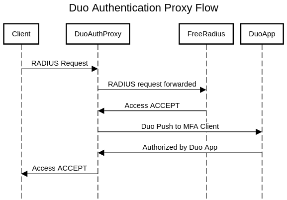

# DUO-PROXY

This provides the Duo Authentication Proxy (<https://duo.com/docs/authproxy-reference>) as a docker container.  Duo provides the Authentication Proxy installation source for both Windows and Linux systems, but does not provide a Docker container that can be used to quickly spin up instances.

   NOTE: Duo provides scale numbers of 2000 auths/min for the Linux system, however running in Docker will likely decrease the max scale.  This container has not been tested for scale.

## NEW FEATURES!

v1.0.5 - Added DNS resolver for RADIUS server host.  See notes below for details on using

## Use Cases

This container was created to provide 2FA for an existing FreeRadius deployment that is used to authenticate OpenVPN clients, router/switch/firewall logins, etc.  The Duo Authentication Proxy is capable of using LDAP as a backend, however that was not specifically tested with this container.

The tested use case is as follows:

(Built using https://sequencediagram.org/)

## Setup

### Duo authproxy.cfg

The Duo documentation should be used for the configuration: <https://duo.com/docs/authproxy-reference#main-section>

A sample (simple) configuration is as follows:

    [radius_client]
    host=10.10.10.10            # IP of backend RADIUS server
    secret=....                 # RADIUS secret for the DUO server NAS
    pass_through_all=true       # Set this to 'true' (see notes below)

    [radius_server_auto]
    ikey=....                   # ikey, skey, api_host from your Duo admin panel
    skey=....
    api_host=....
    failmode=safe               # safe returns RADIUS response if DUO not reachable
    client=radius_client
    port=1812
    factors=push,passcode       
    radius_ip_1=10.0.0.1        # define the client IP and secrets
    radius_secret_1=....
    radius_ip_2=10.1.1.0/24
    radius_secret_2=....

#### Failmode

There are 2 'failmode' options:
- 'safe': In the event that Duo's service cannot be contacted, users' authentication attempts will be permitted if primary authentication succeeds.
- 'secure': In the event that Duo's service cannot be contacted, all users' authentication attempts will be rejected.

#### radius_server_auto

There are multiple different sections that could be used.  'radius_server_auto' supports PEAP and EAP.  EAP-TLS and MSCHAP-v2 are supported when using RADIUS as a the backend (as shown here), and only with a client push (not codes appeneded to the password).

#### client

This specifies the backend section that should be used for the authentication.  In this case it uses the [radius_client] section above to contact the FreeRadius server.

#### radius_ip_x & radius_secret_x

You can add multiple clients by incrementing 'x'.  Duo Authentication Proxy supports an IP address (10.0.0.1), a range of IP's (10.0.0.1-10.0.0.2) or a subnet using CIDR (10.0.0.0/24).

  NOTE: For the secret, you MUST create the secret on the backend system as well, not just in DUO!  The client IP and secret should be created in both systems.

## Running the Container

The container will require the authproxy.cfg file to be mapped to '/opt/duoauthproxy/conf/authproxy'.cfg.  A log folder may also be mapped to '/opt/duoauthproxy/log/' to capture any logs.  The entrypoint script will automatically dump any log data to stdout, however storing the logs outside of the DUO container is useful for troubleshooting.

  NOTE:  Make sure that the authproxy.cfg file is readable by the 'duo' use in the container!  The UID of the user is 40001.  After creating your authproxy.cfg file, run 'chown 40001: authproxy.cfg' to set the 'duo' user as the owner.  The log dir MUST be writable by 'duo' as well.  Generally setting the UID of 'duo' as the owner is the simplest method.  NOT SETTING PERMISSIONS CORRECTLY WILL RESULT IN ERRORS WHEN THE CONTAINER STARTS!

    docker run --name duo-proxy -d -p 1812:1812 -v [path]/authproxy.cfg:/opt/duoauthproxy/conf/authproxy.cfg -v [path]/log/:/opt/duoauthproxy/log/ learningtopi/duo-proxy

## Changing the UID

If you need to use a different UID to match a user in your host system, download the Dockerfile and build with a new UID as a parameter:

    docker build --build-arg UID=40001 -t duo-proxy-local:latest .

## RADIUS DNS Server Resolver

(added in v1.0.5 - or docker image learningtopi/duo-proxy:6.4.1-2)

The DUO Auth proxy service will not resolve hostnames entered for RADIUS servers, only IP addresses are supported.  In order to work around this limitation, a 'resolver.py' script has been added to the 'entrypoint.sh' file.  This script will replace any DNS names entered as a radius host with the IP address fo the device.

To use the resolver, you must enable the resolver script using the RESOLVER=TRUE environment variable.  Also the config file must be mapped to /opt/duoauthproxy/conf/authproxy.cfg.resolver.  The script will replace the DNS name with IP addresses and save the file as authproxy.cfg.  The resolver will run each time the container starts.

Updated container run:

    docker run --name duo-proxy -d -p 1812:1812 -v [path]/authproxy.cfg.resolver:/opt/duoauthproxy/conf/authproxy.cfg.resolver -e RESOLVER=TRUE learningtopi/duo-proxy:latest

